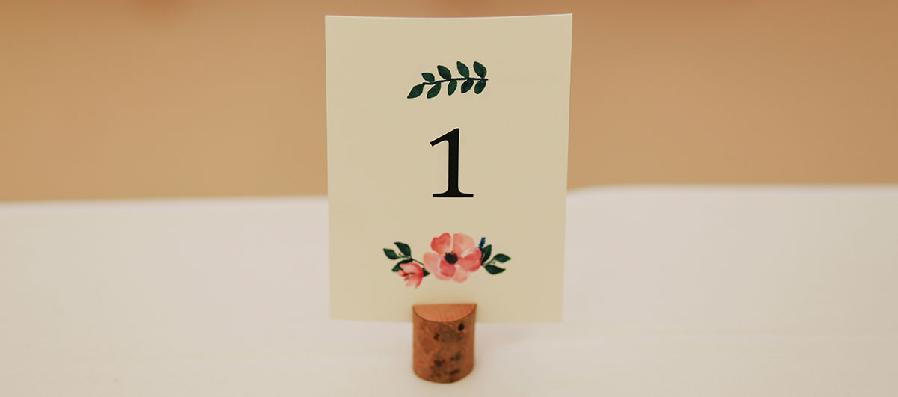

photos by lanty - unsplash

## Creating a new showcase

1. Copy text totally at the bottom of this README with the copy button (right-top of field)

2. make a folder+file by:
    - Go to folder:
   [shows theater freeparty](https://github.com/victrsite/viccie/tree/main/content/shows-theater%) /
   [kunst decor](https://github.com/victrsite/viccie/tree/main/content/kunst-decor) /
   [omgebouwde wagens](https://github.com/victrsite/viccie/tree/main/content/omgebouwde-wagens) /
   [losse projecten](https://github.com/victrsite/viccie/tree/main/content/losse-projecten) /
    - add file (right-top) - create new file
    - behind blue "viccie" (left-top) u can put the name in the empty field 
    - name it: subject/index.md (rename "subject" to an appropr name for ur showcase)

3. u created a folder and a index.md-file. Now add content:
   - paste the copied text at step 1  in this file
   - change what u need in the page (title, description,category are manditory for a nice working site)
   - press "commit changes" (green button top left)
   - give a description of the edit u made (or keep proposal)
   - "commit changes" (green button)

4. Yay the text+infos are there. Now put a picture in the just created folder for a background and thumbnail:
   - add file - upload file - commit - commit 
> For now only jpeg or png. The filename should start with "feature". 

5. Populate the gallery:
   - add as much pics as u want.
   - name the files smart cause it is alfabetically-numerically ordered:
       <br>feature (the featured, background pic) starts with "fea" so think about this.

> Below the standard example text for in index.md. 
It is very important to correctly write things down. 
Dont remove white lines. 


```shell
---
categories: ['theater', 'freakshow', 'shows', 'wagens', 'kunst', 'decor', 'lamp', 'slingbike', 'poorten']
title: "JOUW TITEL HIER"
date: 2023-09-30
description: "JOUW TEXT HIER"

cascade:
  showDate: true
  showAuthor: false
---

JOUW TEXT HIER








```

The english version (index.en.md):

```shell
---
categories: ['theatre', 'freakshow', 'shows', 'cars', 'art', 'decor', 'lamp', 'slingbike', 'gates']
title: "UR TITLE HERE"
date: 2023-09-30
description: "UR DESCRIPTION HERE"

cascade:
  showDate: true
  showAuthor: false
---

UR DESCRIPTION HERE








```